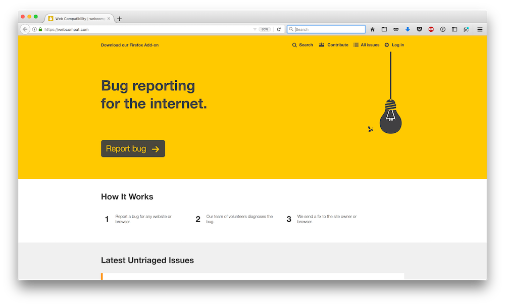

web-bugs
========

A repo used by the Web Compatibility community to track issues reported via [webcompat.com](http://webcompat.com)

### Labels
Labels are used for helping to filter bugs into groups but also to track the status of the bug. Here’s what each label means:

- `browser-xyz` - The bug exists in *xyz* browser
- `ios` - The bug exists in an iOS browser
- `mobile` - The bug exists on mobile devices
- `nsfw` - The website has content that could be considered offensive
- `os-android` - The bug exists in an Android browser
- `windows` - The bug exists in a Windows browser

##### Open Statuses
Status labels which should only be used when a bug report is still open. These are in the order the bug process should typically follow, with the exception of needsinfo and leaveopen.
- `status-needstriage` - The issue needs to be screened and prioritized
- `status-needsdiagnosis` - Issue needs further analysis to find the cause
- `status-needscontact` - The issue has been analyzed, a contact for the site is required
- `status-contactready` - A contact has been found, it is ready for someone to contact the site
- `status-sitewait` - The web site with the issue has been contacted
- `status-needsinfo` - Issue needs more information, usually means process is blocked until info is provided.
- `status-leave-open` - The issue has been analyzed, and for some reason it was decided that this issue needs to remain open. The person who labeled it this way, will handle it further.

##### Closed Statuses
Status labels which should only be used when a bug report is closed.
- `status-duplicate` - Issue is the same as an already-reported issue
- `status-fixed` - Issue is fixed
- `status-incomplete` - The report requires more information to be actionable
- `status-invalid` - Issue is not a web compatibility issue
- `status-wontfix` - The issue will not be fixed
- `status-worksforme` - The issue can't be reproduced

### Best practices

If you’re using Webcompat.com already, you’re probably pretty awesome. So why do you need to read this? Well from experience we know a few tricks that make the web compatibility process go even smoother. And who doesn’t want to learn sweet new tricks?

#### Filing web compatibility bugs
- Fill the bug report form out completely. The more information you provide the easier it is for volunteers to understand the problem
- List any other browsers you tested the site with
- Try to avoid reporting issues for sites that are broken in all browsers. We like to focus our energy on sites that work in one browser but not others
- If you feel comfortable dig in and analyze the bug as well

#### Analyzing web compatibility bugs
- Confirm that you can reproduce the error. Ideally you should use a clean browser profile. See [this tutorial for Firefox](http://www.otsukare.info/2014/11/12/configure-webcompat-browser).
- Set any related labels - if the bug appears on Chrome for Android, set the “browser-chrome” and “os-android” labels
- Provide details on which piece of code is broken
- List out any relevant error codes
- If possible, suggest a way to fix the code to work in all browsers
- Once complete, add the “status-contactready” label
- If you feel comfortable find a contact at the site and reach out

#### Contacting the site/company
- Once a bug is set to “status-contactready” the site can be contacted
- After you have attempted to make contact remove the "status-contactready" label and add "status-sitewait" so others don't attempt to contact
- Leave details about who you are contacting, example “Joe Webmaster - Developer at Company X”
- Be careful not to leak any private information like email addresses, phone numbers
- If you post somewhere public like twitter, include the link to the tweet in the bug for easy tracking
- If you receive an issue tracking number from the site include this in the bug
- When you receive responses, leave some information on the bug (paraphrasing is fine)
- If no response is received after a week or two, try another method. After a month or three contact attempts we can stop and revisit it later
